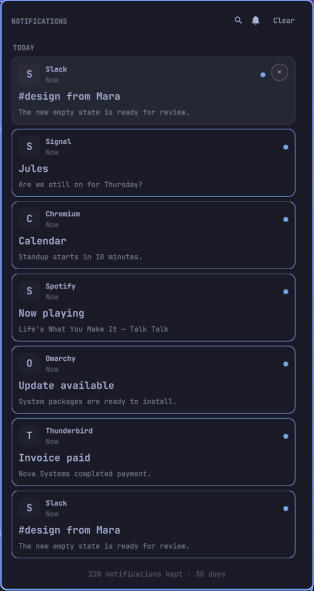

# RiteChoice23 Notification Center

A private, searchable, keyboard-driven notification center for the Omarchy top bar.

It keeps every retained notification as an individual chronological card, follows Omarchy’s active palette and corner radius, and provides a durable history without turning notification-provided shell commands into delayed click actions.



## Highlights

- **Searchable history** — Search app names, titles, and message bodies with the header button, `/`, or `Ctrl+F`.
- **Individual chronological cards** — Newest first, separated into Today, Yesterday, weekdays, and older dates.
- **Complete keyboard control** — Arrow or Vim navigation, Enter to activate, `x` to dismiss, Escape to close, and Tab to switch panels.
- **Safe click-to-open** — Opens only a validated archived image or focuses the strongest matching existing Hyprland window. Stored shell text is never executed.
- **Exact PWA focus** — Web origins, desktop entries, `StartupWMClass`, and normalized client metadata are scored before focusing the exact window address.
- **Do Not Disturb** — Toggle DND in the panel or right-click the bar bell without opening it.
- **Private durable storage** — State directories are `0700`; records and media are `0600`; writes and multi-monitor access are serialized.
- **Bounded retention** — Age and count limits both apply, with orphaned media removed automatically.
- **Privacy controls** — Hide message bodies, disable and purge picture previews, or remove the unread marker.
- **Omarchy-native UI** — Uses the shell’s shared controls, colors, typography, spacing, border specifications, and adaptive screen bounds.

## Installation

```bash
omarchy plugin add https://github.com/ritechoice23/ritechoice23-omarchy-notification.git --enable --yes
omarchy bar put ritechoice23.omarchy.notification --before omarchy.power
```

For local development:

```bash
bash install-local.sh
```

The local installer validates and stages the complete plugin before replacing the installed copy, then restarts the Omarchy shell to avoid stale compiled QML.

## Controls

| Input | Action |
| --- | --- |
| Left-click bar bell | Toggle the notification center |
| Right-click bar bell | Toggle Do Not Disturb |
| Left-click card | Dismiss immediately, then safely open its image or focus its app in the background |
| Right-side `×` | Dismiss one archived notification |
| `/` or `Ctrl+F` | Search notifications |
| `↓` / `j`, `↑` / `k` | Move the selected card |
| `Enter` / `Space` | Activate the selected card |
| `x` | Dismiss the selected card |
| `Escape` | Leave search, then close the panel |
| `Tab` / `Shift+Tab` | Switch to an adjacent bar panel |

Activation removes the card and updates the count immediately. The panel closes while image opening or window focus continues silently in the background; a failed background activation does not restore the card.

## Settings

Configure the widget through `omarchy launch bar-settings` or `omarchy bar set`.

| Setting | Default | Description |
| --- | --- | --- |
| `historyLimit` | `1000` | Maximum retained entries, from 50 to 10,000 |
| `keepDays` | `30` | Maximum age, from 1 to 365 days |
| `badge` | `Count` | `Dot`, `Count`, or `None` |
| `clickAction` | `Auto` | `Auto`, `Focus the app`, or `Nothing` |
| `showBody` | `true` | Show message text in cards |
| `showPreview` | `true` | Keep and display validated pictures; disabling purges cached previews |
| `panelWidth` | `440` | Preferred width, automatically clamped to the display |

Existing v1 `showBadge` preferences remain effective until the new `badge` setting is explicitly saved.

## IPC

```bash
omarchy-shell shell toggle ritechoice23.omarchy.notification
omarchy-shell shell summon ritechoice23.omarchy.notification
omarchy-shell shell hide ritechoice23.omarchy.notification
omarchy-shell ritechoice23.omarchy.notification clear
omarchy-shell ritechoice23.omarchy.notification unread
```

## Storage CLI

The JSON-producing storage CLI is available inside the plugin:

```bash
bin/notification-center list 100
bin/notification-center search "deployment" 1000
bin/notification-center unread
bin/notification-center prune
bin/notification-center seed 25
bin/notification-center --help
```

Internal commands also include `watch`, `sync`, `remove`, `clear`, and `seen`. Environment variables used by the widget are documented in the script and make the store testable against isolated directories.

## Privacy and security

The archive lives at:

```text
~/.local/state/ritechoice23-omarchy-notification/
├── history/
├── images/
├── dismissed/
├── last-seen
└── state.lock
```

Notification history can contain private chats, email subjects, and authentication codes. Do not sync or back up this directory carelessly. Reducing `keepDays`, disabling message bodies, or disabling previews reduces exposure.

Any local application can submit a desktop notification and choose its metadata. For that reason v2 removes `exec` and action fields while archiving and never evaluates them during activation. Media copies are limited to 5 MiB, must be recognized as images, are stored privately, and are opened by argument rather than through a shell.

## Upgrading from v1

Version 2 keeps the existing per-notification archive and seen watermark. On the first v2 synchronization it:

- repairs private permissions;
- removes any stored `exec` or action fields;
- applies the configured age and count limits;
- validates new media copies and sweeps orphaned cached files.

Existing notification text and safe cached media are preserved. Because click behavior is intentionally hardened, the release version is `2.0.0`.

## Development and validation

```bash
omarchy plugin validate .
bash tests/test-data.sh
bash tests/test-activation.sh
bash scripts/demo-notifications
```

Use `bin/notification-center seed 25` for a synthetic private-data-free archive suitable for UI development and screenshots.

## Removal

```bash
omarchy plugin remove ritechoice23.omarchy.notification
```

Removing the plugin intentionally keeps history. Delete it separately only when desired:

```bash
rm -rf "${XDG_STATE_HOME:-$HOME/.local/state}/ritechoice23-omarchy-notification"
```

## License

[MIT](LICENSE)
